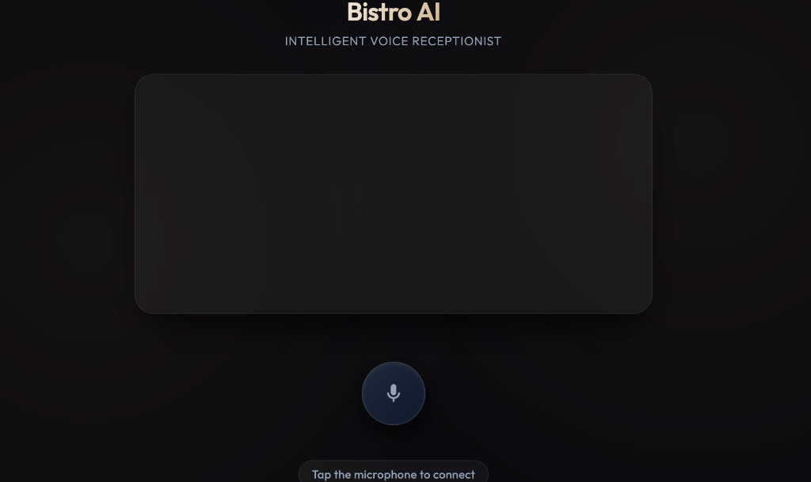

# Bistro AI Voice Agent




A production-oriented, real-time conversational AI voice agent designed for ultra-low latency, bidirectional speech interactions. The system combines modern speech processing and large language models into a unified streaming pipeline, enabling natural, interruption-aware conversations that closely resemble human dialogue.

Built using an asynchronous, modular architecture, the application processes speech continuously from microphone input through voice activity detection, transcription, language understanding, and speech synthesis before streaming the generated audio response back to the client in real time.

---

# Architecture

The application follows an event-driven architecture centered around persistent WebSocket communication, allowing simultaneous audio transmission and reception with minimal latency.

## Backend

* **Framework:** FastAPI (Python)
* **Communication:** Asynchronous WebSocket endpoints for real-time bidirectional streaming
* **Concurrency:** Fully asynchronous request handling using Python's `asyncio`

## Speech Processing Pipeline

### Voice Activity Detection (VAD)

Silero VAD is used to detect speech boundaries with high accuracy and low latency, ensuring efficient audio processing while minimizing unnecessary transcription requests.

### Speech-to-Text (STT)

Faster-Whisper (Systran implementation) provides high-performance speech recognition optimized for streaming audio workloads, delivering fast and accurate transcriptions.

### Language Model

The conversational reasoning layer integrates with NVIDIA API endpoints (or any OpenAI-compatible API), enabling context-aware dialogue generation with support for conversational memory and prompt customization.

### Text-to-Speech (TTS)

Edge-TTS synthesizes natural-sounding speech and streams generated audio incrementally, reducing perceived response latency while maintaining conversational fluidity.

## Frontend

The client application is built using Vanilla JavaScript and the HTML5 Web Audio API.

The frontend is responsible for:

* Capturing microphone audio
* Streaming audio chunks to the backend over WebSockets
* Receiving synthesized speech
* Playing streamed audio with minimal delay
* Managing conversation state and interruption events

---

# Key Features

## Real-Time Bidirectional Streaming

Supports simultaneous audio input and output through persistent WebSocket connections, enabling uninterrupted conversational interaction.

## Full-Duplex Communication

Users can continue speaking while the assistant is generating responses, creating a natural conversational experience rather than a traditional request-response workflow.

## Interruption Handling

The system supports barge-in functionality, allowing users to interrupt the assistant during speech generation. Ongoing text-to-speech synthesis is immediately halted, and incoming speech is prioritized for processing.

## Modular Architecture

Each stage of the speech pipeline is implemented as an independent module:

* Voice Activity Detection
* Speech Recognition
* Language Model Integration
* Speech Synthesis

This modular design allows components to be replaced or upgraded independently without requiring changes to the overall application architecture.

## Low-Latency Processing

Streaming is implemented throughout the pipeline to minimize end-to-end response time, providing a responsive conversational experience suitable for real-time voice applications.

## Cross-Origin Support

CORS middleware is configured to allow secure integration with external frontend applications, enabling deployment across different domains or portfolio websites.

---

# Live Demonstration

The backend is securely exposed through a Cloudflare Tunnel, providing public access to the WebSocket endpoint without exposing the host machine directly.

**WebSocket Endpoint**

```text
wss://bureau-render-lightweight-quoted.trycloudflare.com/ws
```

The demonstration frontend is preconfigured to connect to this endpoint automatically.

Availability depends on the host machine and the active Cloudflare Tunnel session.

---

# Technology Stack

| Component                | Technology                               |
| ------------------------ | ---------------------------------------- |
| Backend                  | FastAPI                                  |
| Programming Language     | Python 3.11+                             |
| Communication            | WebSockets                               |
| Voice Activity Detection | Silero VAD                               |
| Speech-to-Text           | Faster-Whisper                           |
| Language Model           | NVIDIA API / OpenAI-Compatible APIs      |
| Text-to-Speech           | Edge-TTS                                 |
| Frontend                 | HTML5, Vanilla JavaScript, Web Audio API |
| Deployment               | Cloudflare Tunnel                        |

---

# Installation

## Prerequisites

* Python 3.11 or later
* FFmpeg

---

## Setup

Clone the repository:

```bash
git clone https://github.com/AdityaInamdar334/bistro-ai-voice.git
cd bistro-ai-voice
```

Install the required dependencies:

```bash
pip install -r requirements.txt
```

Configure the required environment variables:

```bash
export NVIDIA_API_KEY="your-api-key"
```

Start the FastAPI server:

```bash
uvicorn main:app --host 0.0.0.0 --port 8000
```

Open `client/index.html` in a web browser.

For local development, update the WebSocket endpoint inside `client/index.html`:

```text
ws://localhost:8000/ws
```

---

# Project Structure

```text
.
├── main.py                 # FastAPI application entry point
├── modules/
│   ├── vad.py              # Voice Activity Detection
│   ├── stt.py              # Speech-to-Text pipeline
│   ├── llm.py              # Language model integration
│   └── tts.py              # Text-to-Speech synthesis
├── client/
│   ├── index.html
│   ├── script.js
│   └── style.css
└── requirements.txt
```

---

# Design Principles

The project emphasizes scalability, maintainability, and extensibility.

* Modular service-oriented architecture
* Fully asynchronous processing pipeline
* Streaming-first communication model
* Clear separation between frontend and backend responsibilities
* Easily replaceable AI components
* Production-ready WebSocket communication
* Low-latency speech processing

The architecture enables developers to integrate alternative speech recognition models, language models, or speech synthesis engines with minimal changes to the surrounding infrastructure, making the system suitable for research, rapid prototyping, and production deployment.
